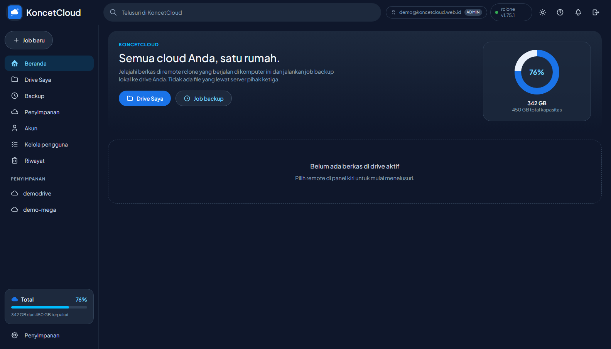
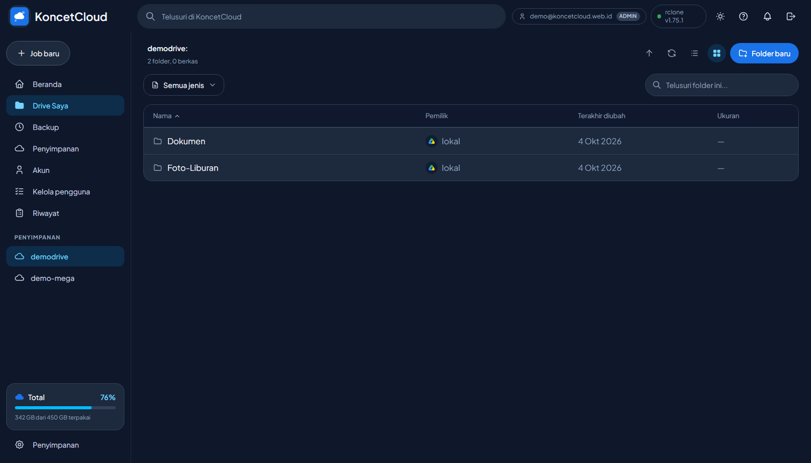
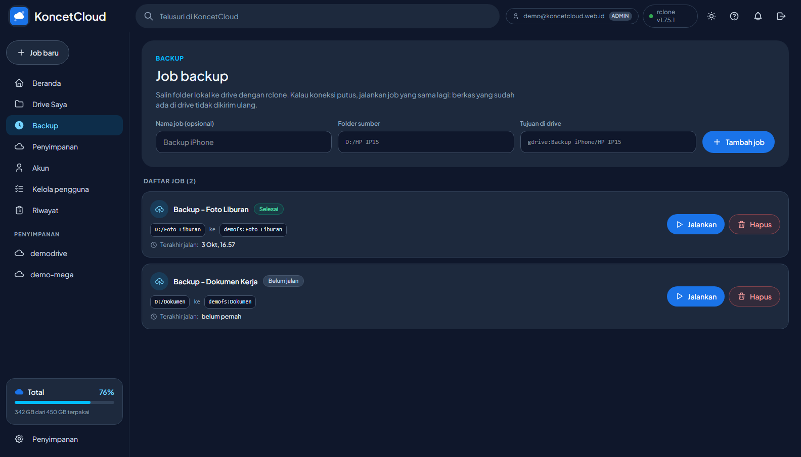
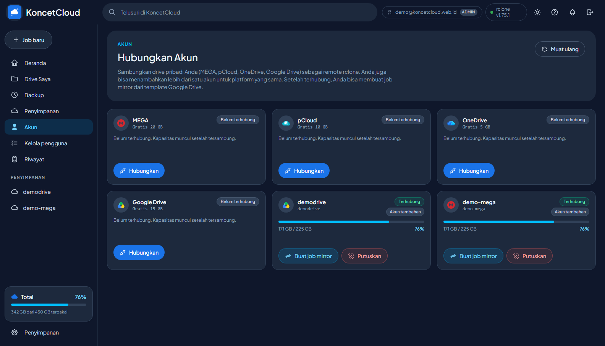

<p align="center">
  
</p>

# KoncetCloud

[](https://nodejs.org/) [](https://expressjs.com/) [](https://vuejs.org/) [](https://vitejs.dev/) [](https://tailwindcss.com/) [](https://rclone.org/) [](https://github.com/apissaj/koncetcloud/actions/workflows/ci.yml)


**KoncetCloud** adalah antarmuka web sendiri (self-hosted) untuk **rclone** - jelajahi berkas, kelola job backup, dan pantau kuota dari banyak penyedia cloud dalam satu tempat. Aplikasi ini menangani **control plane** saja; data tidak pernah lewat proses ini. rclone yang mengunggah, server ini hanya memberi perintah.

Antarmuka terinspirasi dari [OmniCloud](https://github.com/dimartarmizi/OmniCloud) (MIT) - lihat [CREDITS.md](CREDITS.md).

## Fitur utama

### Banyak penyedia, satu tempat
- Hubungkan Google Drive, MEGA, pCloud, OneDrive, dan backend rclone lainnya
- Beberapa akun untuk platform yang sama (`gdrive2`, `mega2`, ...)
- Kapasitas, pemakaian, dan nama akun ditampilkan per remote

### Penjelajah berkas
- Tampilan daftar dan ikon (grid), kolom bisa diurutkan
- Buat folder, ubah nama, hapus, dan unduh
- Pratinjau gambar dan video langsung dari penyimpanan
- Pencarian per folder dan filter jenis berkas

### Job backup
- Salin folder lokal ke remote dengan `sync/copy` rclone secara asinkron
- Aman dari duplikat: kunci anti-dobel mencegah dua job menulis ke tujuan yang sama
- Idempoten - putus koneksi? Jalankan ulang, rclone melanjutkan dari sisanya
- Preflight read-only dengan `operations/check` (bukan dry-run)

### Multi-pengguna
- Dua peran: `admin` (akses penuh) dan `viewer` (hanya melihat/mengunduh)
- Bikin user viewer sebanyak yang diperlukan dari UI
- Riwayat aksi (audit log) mencatat siapa melakukan apa

### Keamanan
- Login dengan scrypt + sesi token HMAC (HttpOnly, SameSite, Secure otomatis di HTTPS)
- Rate-limit percobaan login per pengguna
- Header keamanan (nosniff, X-Frame-Options DENY, Referrer-Policy, Permissions-Policy)

## Pratinjau






## Arsitektur

```
Browser (Vue 3 + Vite + Tailwind)
   |  /api/*   (sesi login; aksi tulis butuh role admin)
   v
KoncetCloud server (Express, port 5599)
   |  RC API, form-encoded (127.0.0.1:5572)
   v
rclone rcd --rc-serve
   |
   v
Google Drive / MEGA / pCloud / OneDrive / remote lain
```

Server **tidak menyimpan berkas**. Pratinjau dan unduhan diarahkan (redirect) ke server web bawaan rclone (`--rc-serve`), jadi byte tidak pernah melalui proses Node.

## Mulai cepat

### Prasyarat
- Node.js 20+ (uji pada 20/22)
- `rclone` di `PATH` (versi 1.75.x teruji)
- Remote rclone (mis. `gdrive:`) sudah dikonfigurasi

### Menjalankan

```bash
# Install
cd web && npm install
cd ../server && npm install

# Jalankan daemon rclone (buka RC API + server file)
rclone rcd --rc-addr 127.0.0.1:5572 --rc-no-auth --rc-serve

# Jalankan server KoncetCloud
cd server && node index.js
```

Buka `http://127.0.0.1:5599`. Saat pertama jalan, server membuat pengguna `admin` dengan password acak yang disimpan di `server/.password.txt`.

Build frontend produksi:

```bash
cd web && npm run build   # output ke web/dist, disajikan oleh server
```

### Windows

`start.bat` (mulai rclone + server), `stop.bat` (hentikan), `add-remote.bat`
(wizard koneksi remote), `status-remote.bat` (cek kapasitas semua remote).

## Penyedia yang didukung

| Penyedia | Model koneksi | Catatan |
| --- | --- | --- |
| Google Drive | OAuth | Perlu OAuth client sendiri; app unverified dibatasi 100 pengguna |
| MEGA | Email + password | Di-obscure sebelum disimpan ke konfigurasi rclone |
| pCloud | OAuth | |
| OneDrive | OAuth | |
| Remote rclone lain | Otomatis | Muncul di sidebar tanpa perubahan kode |

## Job backup & anti-duplikat

Job memanggil `sync/copy` secara asinkron lewat RC API. KoncetCloud menjaga
kunci per job dan per tujuan:

- `already_running` - job yang sama sedang berjalan
- `dest_busy` - job lain sedang menulis ke tujuan yang sama (sumber duplikat
  7,4 GB yang pernah terjadi, sekarang dicegah)
- Status `running` yang basi disinkronkan ulang (reconcile) agar kunci tidak
  nyangkut setelah server restart

Preflight read-only (tanpa mengunggah apa pun):

```bash
bash scripts/preflight.sh
```

Jangan pernah memakai `dryRun=true` lewat RC API - pada rclone 1.75.x parameter
itu diabaikan dan file benar-benar terunggah. Untuk menghentikan transfer:

```
curl -X POST http://127.0.0.1:5572/job/stop --data-urlencode 'jobid=N'
```

## Struktur proyek

```
server/                  # Express control plane
  index.js               # rute API + job backup + guard anti-duplikat
  auth.js                # multi-pengguna, sesi, rate-limit
  platforms.js           # koneksi penyedia (form & OAuth)
  jobs.json              # daftar job (data lokal)
web/                     # Vue 3 + Vite + Tailwind
  src/components/        # panel, penjelajah berkas, kelola akun, audit
  src/composables/       # format & ikon berkas
scripts/                 # preflight read-only, pembuat job mirror
```

## Keamanan & privasi

- Kredensial penyimpanan tersimpan di konfigurasi rclone di mesin ini, tidak
  pernah di log oleh server.
- Password pengguna tersimpan sebagai scrypt, sesi token HMAC.
- Aksi yang mengubah data dibatasi ke admin; viewer hanya membaca.
- Audit log di `server/logs/audit.jsonl` (lihat halaman Riwayat).
- Jangan mengekspos port RC rclone (5572) ke internet. Untuk akses publik,
  letakkan KoncetCloud di belakang HTTPS (mis. Cloudflare Tunnel).

## Akses publik (Cloudflare Tunnel)

KoncetCloud dirancang untuk dipakai sendiri. Untuk mengaksesnya dari internet
dengan HTTPS tanpa membuka port (aman meski IP dinamis), pakai Cloudflare Tunnel:

1. Install cloudflared:
   ```
   winget install --id Cloudflare.cloudflared
   ```
2. Buat tunnel di [Cloudflare Zero Trust](https://one.dash.cloudflare.com/) ->
   Networks -> Tunnels -> Create a tunnel (Cloudflared). Beri nama, lalu di step
   Public Hostname set:
   - Subdomain/domain: `kc.koncetcloud.web.id`
   - Service: `http://localhost:5599`
3. Simpan token dari dashboard ke `scripts/tunnel.token` (satu baris).
   File ini sudah masuk `.gitignore`, jangan pernah di-commit.
4. Pasang sebagai service Windows:
   ```
   scripts\install-tunnel.bat
   ```
5. Cek status: `scripts\tunnel-status.bat`

### Pengaman waktu publik

- Server mendeteksi `x-forwarded-proto: https` dan menandai cookie sesi sebagai
  `Secure` otomatis.
- `trust proxy` aktif supaya rate-limit login membaca IP asli pengunjung.
- Jangan pernah mengekspos port rclone RC (`5572`) ke internet.
- Laptop harus menyala dan KoncetCloud berjalan agar aplikasi bisa diakses
  (beda dari aplikasi serverless yang jalan 24/7 di Cloudflare).

## Kontribusi

Baca [CONTRIBUTING.md](CONTRIBUTING.md).

## Lisensi

MIT - lihat [LICENSE](LICENSE) dan [CREDITS.md](CREDITS.md) (atribusi OmniCloud).
